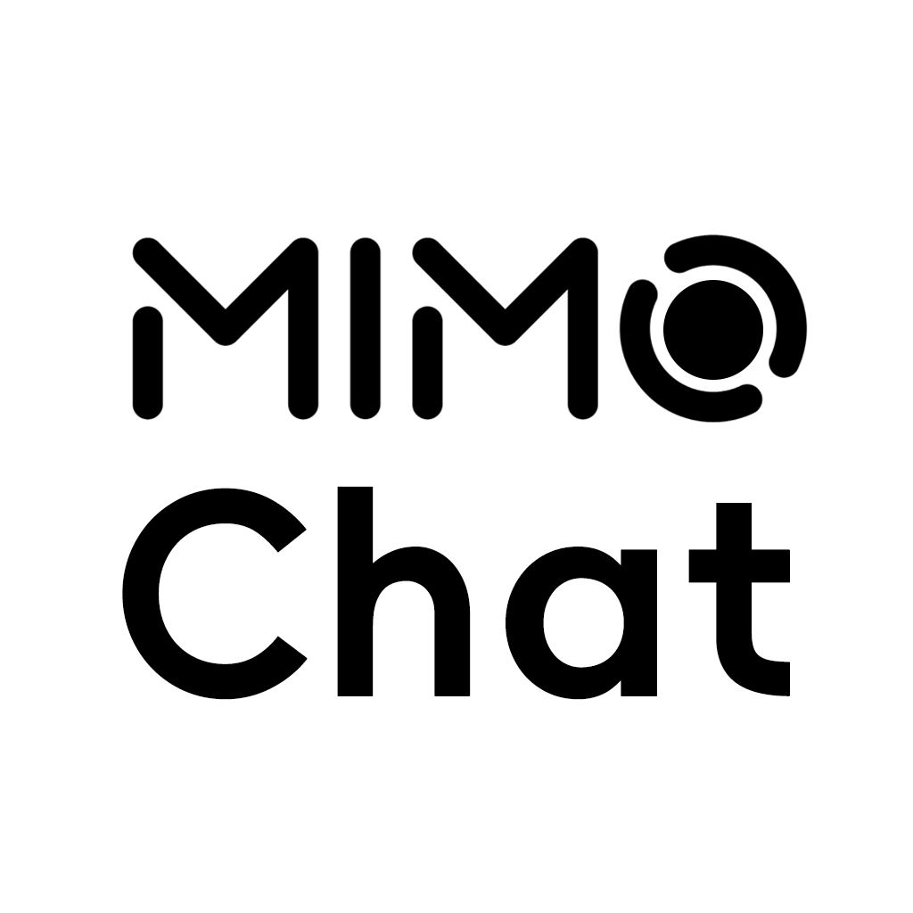

  

 

MIMO Chat - 非官方小米 MiMo 大模型 Android 客户端

> [!NOTE]
> An Android client built with Kotlin that provides quick integration with the Xiaomi MIMO series Large Model APIs. Features include LaTeX rendering, custom prompts, 和 large model skills
> 基于 Kotlin 开发的安卓客户端，快速接入小米 MIMO 系列大模型 API，支持 LaTeX 渲染、自定义提示词与大模型技能等功能

> [!TIP]
> 若你正在使用小米 [百万亿 token 创造者激励计划](https://100t.xiaomimimo.com/) 所赠送的 Token，请在设置中将 API Base URL 更改为订阅接口

---

## ✨ 功能

- 多模型切换支持
- 代码块语法高亮（支持多种编程语言）
- LaTeX 数学公式渲染
- Markdown 内容渲染
- 思考过程展示
- 对话历史管理
- 暗色/亮色主题切换
- 多彩主题支持（小米橙、初音绿、盎然绿、罗兰紫）
- 自定义系统提示词
- 移动端与平板端自适应布局

## 🚀 快速开始

### 安装

#### 方式一：从 GitHub Releases 下载（推荐）

1. 访问 [GitHub Releases](https://github.com/MRoldL001/MIMO-Chat/releases)
2. 下载最新的 APK 文件
3. 在手机上安装（可能需要允许未知来源应用）

#### 方式二：从源码构建

1. 克隆仓库
2. 使用 Android Studio 打开项目
3. 同步 Gradle
4. 运行或构建 APK

### 配置

1. 首次打开应用，点击右上角设置图标
2. 设置你的小米 MiMo API Key
3. （可选）配置 API Base URL
4. （可选）设置自定义系统提示词
5. 开始聊天！

## 📱 系统要求

- Android 7.0 (API 24) 或更高版本
- 支持手机和平板设备

## 🎨 主题

应用支持多种主题颜色：

| 主题     | 主色调       |
| ------ | --------- |
| 默认（白色） | 黑白系       |
| 动态色彩   | 跟随系统      |
| 小米橙    | `#FF7E00` |
| 初音绿    | `#39C5BB` |
| 盎然绿    | `#006E2A` |
| 罗兰紫    | `#6650A4` |

## 📖 使用说明

### 发送消息

在底部输入框输入内容，点击发送按钮发送消息。

### 切换模型

点击顶部当前模型名称，在弹出的模型选择器中选择其他模型。

### 查看思考过程

当 AI 启用思考模式时，可以点击展开"思考过程"卡片查看 AI 的推理过程。

### 复制代码

代码块右上角提供复制按钮，点击即可复制代码内容。

### 管理对话

- 新建对话：点击侧边栏新建按钮
- 选择对话：点击侧边栏中的历史对话
- 删除对话：在对话列表中点击删除图标

## 🔧 高级功能

### 思考模式

启用后，AI 会展示其思考推理过程，适合学习和理解 AI 的思维方式。

### 技能模式

- **诗人模式**：将你输入的内容转化为古体诗
- **学习模式**：采用循序渐进的教学方式，帮你学习新知识

### 自定义提示词

在设置中可以添加自定义系统提示词，自定义 AI 的行为和风格。

## 📄 免责声明

本应用与小米公司（Xiaomi Corporation）及其关联公司（包括但不限于小米科技有限责任公司、北京小米移动软件有限公司等）**没有任何形式的隶属、授权、合作或关联关系**。本应用并非小米公司的官方产品，也未获得小米公司的官方赞助、认可或背书。

本应用中提及的“小米”、“Xiaomi”、“MIUI”、“澎湃OS (HyperOS)”、“米家”等词汇及相关图形标识，其商标权和知识产权均归小米公司所有。本应用使用上述词汇仅出于描述产品兼容性、功能说明或指示用途的目的（即“指示性合理使用”），绝无任何侵犯小米公司知识产权的意图。

本应用提供的功能和服务由开发者独立承担全部责任。因使用本应用而产生的任何数据丢失、设备异常、隐私泄露或其他直接或间接的损失，均与小米公司无关。小米公司不对本应用的功能性、安全性及合法性承担任何形式的保证或赔偿责任。
